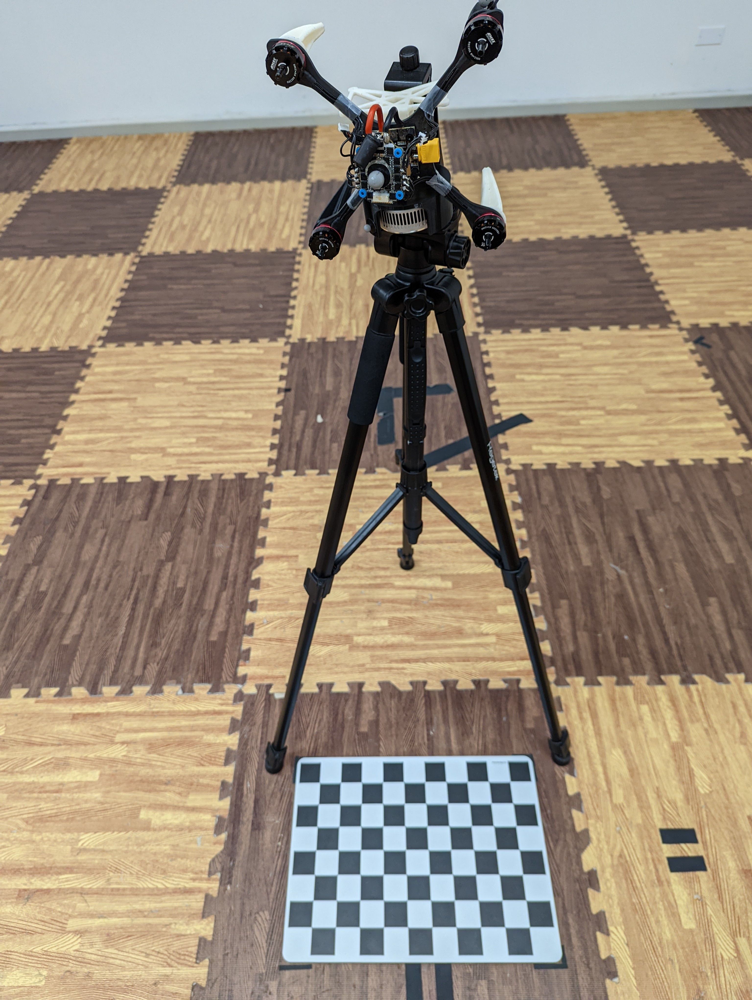

# camera_drone_calibration

A tool for solving the spatial calibration of an monocular camera w.r.t a object body frame in motion capture system along with camera intrinsic parameters

## Prerequisites

This tool is dependent and tested on `Python 3.6.9` and `ROS Melodic`. Python packages including `numpy`, `scipy` and `opencv` should be installed with `pip install`. 
```
$ pip install numpy
$ pip install scipy
$ pip install opencv-python
```

## Compiling

This tool can be compiled as a standard ros package.

```
$ cd /path/to/your/workspace/src
$ git clone https://github.com/gred0216/camera_drone_calibration.git
$ cd ..
$ catkin build camera_drone_calibration
$ source /path/to/your/workspace/devel/setup.bash
```


## Running

1. Put the calibration board on the ground.
2. Fix the camera facing the calibration board. Camera should face the board as perpendicular as possible.
      
   
3. Edit the configuration file in `config/params.yaml` and subscription topics in `launch/camera_drone_calibration.launch`
4. Launch the node in terminal 
   
   `$ roslaunch camera_drone_calibration camera_drone_calibration.launch`
5. Collect the data for 5 seconds when camera is stationary. 
6. Chessboard grid points would be projected to the image using the calibration result. You can move the camera around to see the effect.
7. Result will be saved to yaml file in `result/result.yaml`


The table below summarized the default publication and subscription scheme. The subsciption topic names can be changed in the launch file.

### Subsciption
| Name                      | Type  | Description                                 |
| ------------------------- | ----- | ------------------------------------------- |
| `/camera/color/image_raw` | Image | Image stream from camera                    |
| `/vicon/race1/odom`       | Odom  | Odometry from motion capture system (Vicon) |

### Publication
| Name                              | Type        | Description                 |
| --------------------------------- | ----------- | --------------------------- |
| `/camera/color/image_raw_feature` | Image       | Image with projected points |
| `/camera/body/pose`               | PoseStamped | Pose of camera w.r.t. body  |


### Demo Video

[video](https://www.youtube.com/watch?v=4smXKLLD3MY)


## References
The calibration approaches used in Camera Drone Calibration are based on the following papers. Please cite the appropriate papers when using this toolbox or parts of it in an academic publication.

1. Seong Hun Lee, Javier Civera (2020). Robust single rotation averaging. arXiv preprint arXiv:2004.00732

## TODO
1. color channel
2. distortion model
